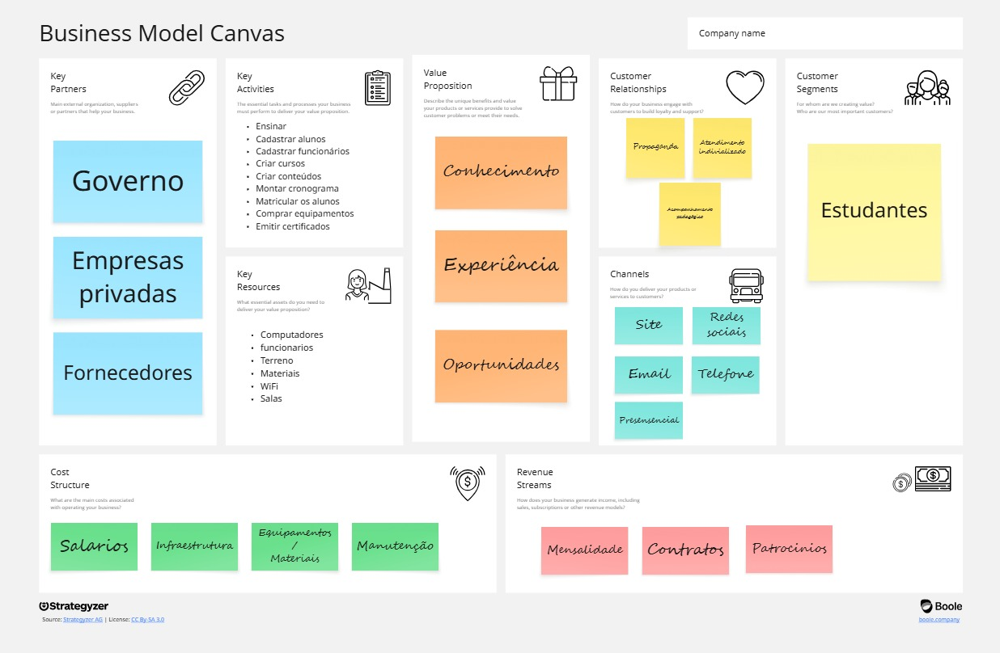
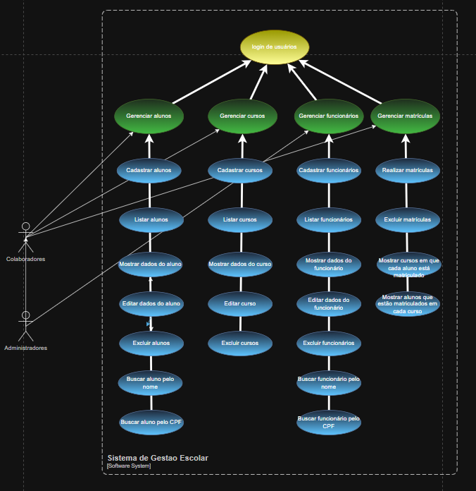

# Sistema de Gestão Escolar

**Sistema para gerenciar administradores, coordenadores, professores, alunos, cursos e matrículas.**

## 1. Quem utilizará o sistema (usuários)?

R: funcionários

## 2. Quais os tipos de usuários e o que cada tipo consegue fazer?

R:

* **Colaboradores:** Cadastrar alunos, cadastrar cursos, editar dados
dos alunos, editar dados dos cursos, excluir alunos, excluir cursos,
listar alunos, listar cursos, matricular alunos nos cursos e desmatricular alunos dos cursos e atualizar os próprios dados.
* **ADM:** Todas as funcoes acima, mais: cadastrar outros funcionários, listar outros funcionários, editar dados dos outros funcionários e excluir outros funcionários.

## 3. Quais informações iremos armazenar?

R:

* **funcionários:** Nome, e-mail, telefone, senha e cargo, data de nascimento, CPF, telefone, endereço
* **Alunos:** Nome, idade, matrícula, e-mail, telefone, data de nascimento, CPF, telefone, endereço. 
* **Cursos:** Nome, descrição, carga horária.
* **Matrículas:** Quais alunos estão cadastrados em quais cursos.

## 4. Quais regras ou restrições são necessárias?

R: 
* Apenas funcioários adimin podem criar/deletar outros funcionários.
* Funcionários colaboradores não podem editar dados de outros funcionários.
* CPF não pode repetir, email não pode repetir
* Nome, email, cargo, cpf, senha, cargahoraria, matricula são obrigatórios.
* Um aluno não pode ser matriculado duas ou mais vezes em um mesmo curso.
* O sistema deve validar as informações.

## PROBLEMA: 
 * Esses sistema é direcionado a funcionários de escolas
 * Permitir o cadastrar, editar, listar e deletar alunos, cursos, maticulas e funcionários

## MODELO DE NEGOCIO

## REQUISITOS
 1. Requisitos Funcionais:
- Cadastrar alunos
- Cadastrar funcionarios
- Cadastrar cursos
- Listar alunos
- Listar cursos
- Listar funcionarios
- Mostrar os dados do aluno
- Mostrar os dados do funcionario
- Mostrar os dados do curso
- Realizar as matriculas
- Editar dados do aluno
- Editar dados do funcionario
- Editar dados do curso
- Excluir os aluno
- Excluir os cursos
- Excluir os funcionarios
- Excluir os matriculas
- Login de usuários
- Buscar aluno pelo nome
- Buscar açuno pelo CPF
- Buscar funcionario pelo nome
- Buscar funcionario pelo CPF
- Mostrar os cursos ek que cada aluno está matriculado
- Mostrar os alunos que estão matriculados em cada curso

  2. Requisitos Não-Funcionais:
- Auntentição
- Interface com navegação padronizada e consistente entre as telas
- Interface reponsiva e adaptativa e diversas resoluções de tela e dispositivos diferentes, como computadires, celular e tablet
- Interface deve ser compatível com os principais navegadores web
- Criptografar as senhas antes de salvá-las no banco de dados
- Disponpivel durante todo o hórario de funcionamento da intituição
- Restringir acesso pelo tipo de usuário

- Segurança 

- validar senha
- Validar nome 
- Validar e-mail
- Validar telefone
- Validar CPF
- Validar data de nascimento
- Validar endereço
- validar idade
- Validação de dados
- Validação de campos obrigatórios
- Validação de formatação de dados
- Validação de entrada 
- Validação de saída
- Verificar se o usuário está logado
- Verificar se o usuário tem permissão para acessar a página
- Verificar se o usuário tem permissão para editar dados
- Verificar se o usuário tem permissão para excluir dados
- Verificar se o usuário não está logado

## REGRAS DE NEGOCIO
- CPF de cada aluno deve ser único
- CPF de cada funcionario deve ser único
- Email de cada funcionario deve ser único
- A matricula de cada aluno deve ser única
- Nome de cada curso deve ser único
- Impedir exclusão de cursos que tenham alunos matriculados
- Impedir exclusão de alunos que estejam matriculados em 1 ou mais cursos

## DIAGRAMA

